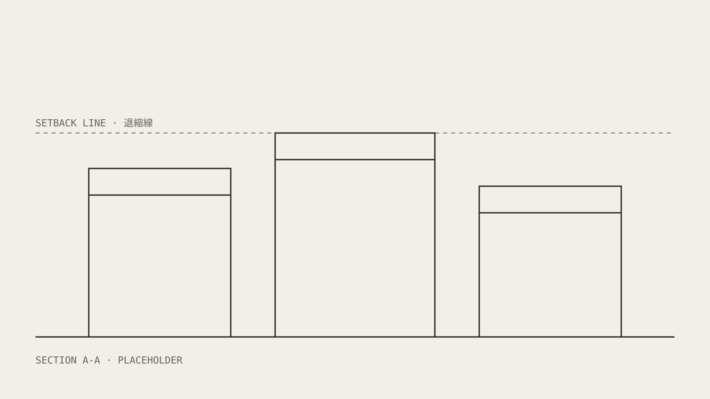

+++
# ── 這篇是元件範例，不會出現在正式站 ──
# draft = true：只有 `hugo server -D` 看得到。要當新文章的起點時，複製整個資料夾再改掉這行。
draft = true

date = '2026-09-22T10:00:00+08:00'
title = '元件範例：Devlog 能用的所有寫法'

# 導言（lede）：標題下方那段灰色的大字；首頁列表的摘要也優先用它。
description = '這篇把 devlog 支援的每一種寫法都用一次：標題、眉標、圖、程式碼、引文、註記、清單與表格。'

# 標籤：文章底部的標籤鍵、側欄的標籤索引、平板以下頁首下方的標籤列都讀這裡。
tags = ['reference', 'devlog']

# 眉標（標題上方那一行小字）= 區段名 · MILESTONE {milestone} ── {eyebrow}
# 兩個都是選填，沒設就只顯示 POSTS。
milestone = 'M0'
eyebrow = '1980-07 W2'
+++

一般段落就是直接寫。**粗體**、[內文連結](https://example.com)、`行內程式碼`
都用標準 Markdown。中英混排不用在中文和英文之間手動加空格以外的東西。

## 二級標題：文章的主要段落

每一篇文章的章節用 `##`。`#` 會比 `##` 大一級，只有像雙語文章要切換語言區塊時才用。

### 三級標題：段落內的小節

#### 四級標題

四級以下就不建議再往下分了。

## 圖

獨立成段的圖片會變成一張「圖紙卡」：抬頭左邊印 alt 文字，右邊自動編 FIG 號碼；
引號裡的 title 會變成下方的圖說。點圖會開原圖。圖檔跟文章放在同一個資料夾即可。



沒有 title 就沒有圖說，只有抬頭：


## 程式碼

程式碼區塊會畫成讀數框。語言寫在反引號後面，抬頭右邊會印出來；
`file` 印在抬頭左邊，`caption` 變成下方的圖說，兩個都是選填。

```rust {file="src/sim/agents.rs" caption="FIG 2 · 每個 agent 同一段邏輯，1 000 000 筆"}
// 每一幀對所有 agent 跑同一段邏輯
pub fn step(agents: &mut [Agent], dt: f32) {
    for a in agents.iter_mut() {
        a.vel = clamp(a.vel + a.acc * dt, 0.0, 13.9);
        a.pos += a.vel * dt;
    }
}
```

超長的一行不會換行，而是在框內橫向捲動；手機上捲動範圍會延伸到螢幕邊：

```wgsl {file="shaders/agents.wgsl"}
@compute @workgroup_size(256) fn main(@builtin(global_invocation_id) id: vec3<u32>) { let i = id.x; if (i >= arrayLength(&agents)) { return; } agents[i].pos += agents[i].vel * params.dt; }
```

什麼都不加也可以，抬頭只會印語言：

```toml
[params]
  build = "0.0.1"
```

## 引文

`>` 開頭的引文用楷體，代表「人的聲音」，適合放居民、玩家或受訪者說的話：

> 「騎樓底下就是我們家的客廳，機車停進來，椅子搬出去。」
>
> —— 陳太太 · 民生東路

## 註記

GitHub 風格的 `> [!TYPE]` 會變成註記框，左上角印出類型。
NOTE、TIP、IMPORTANT、WARNING、CAUTION 都可以用，外觀相同，只有類型字不同。
**`[!TYPE]` 下面一定要空一行 `>`**：這個站開了 CJK 換行合併，不空行的話
`[!NOTE]` 會跟下一行中文黏成同一行，整段內容會被當成標記吃掉。

> [!NOTE]
>
> 這一段是補充說明，可以包含 `程式碼` 和[連結](https://example.com)。

> [!WARNING]
>
> 效能數字是開發機上測的，不代表最終規格。

## 清單

- 無序清單用 `-`
- 第二項
  - 巢狀清單縮兩格

1. 有序清單用數字
2. 第二步
3. 第三步

## 表格

| 項目   | 規格          | 備註           |
| ------ | ------------- | -------------- |
| Agents | 1 000 000     | 全部在 GPU 上  |
| Map    | 10 × 10 km    |                |
| Engine | Rust + wgpu   | Bevy ECS       |

---

分隔線用 `---`，前後要空一行。上面那條就是。
